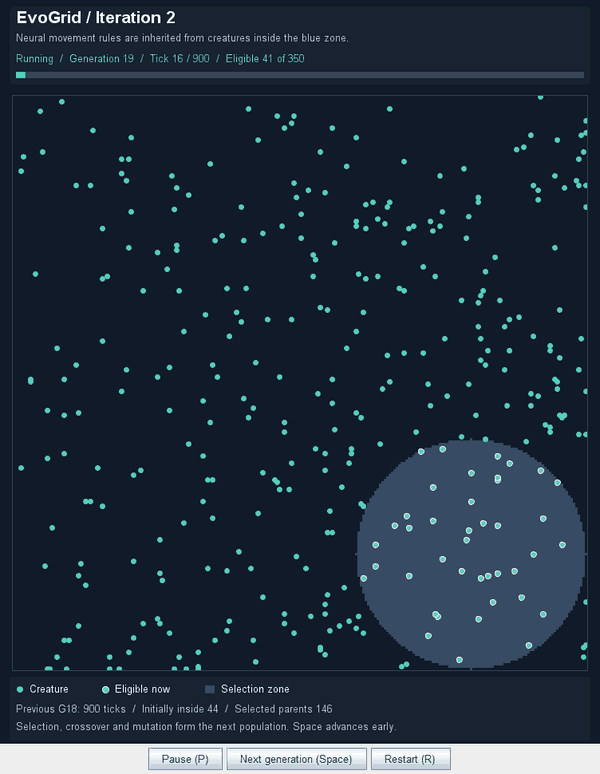
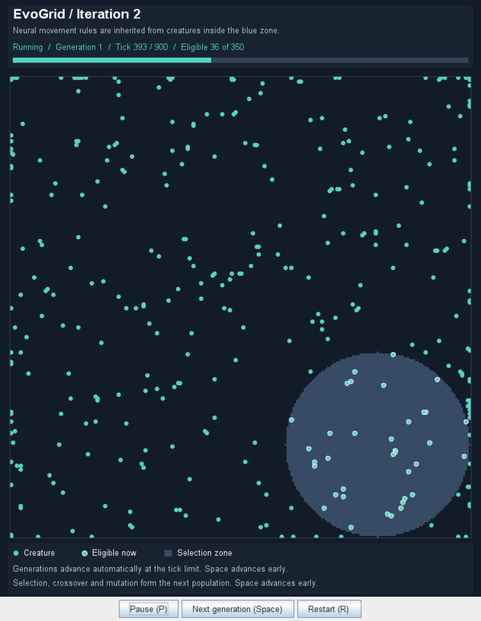
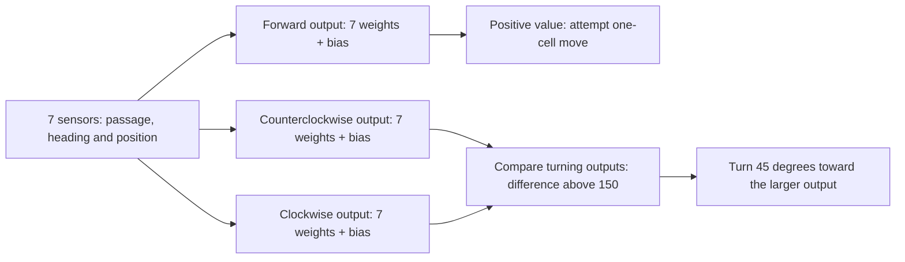
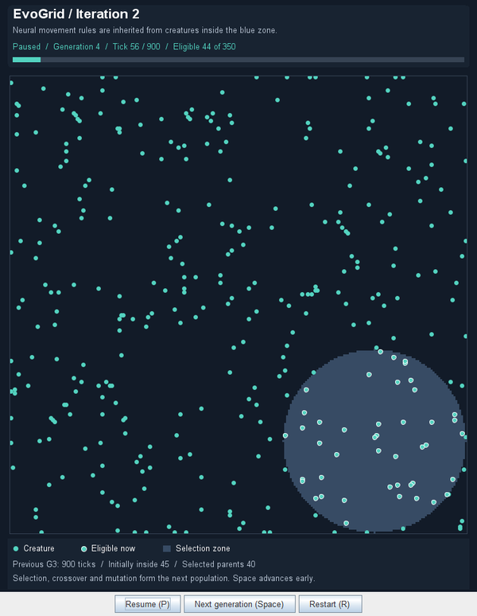

# EvoGrid — Iteration 2

EvoGrid Iteration 2 is a Java desktop simulation in which creatures controlled by
small neural networks move around a grid. At the end of each generation, creatures
inside a fixed selection zone supply the chromosomes for the next population.
Selection, crossover and mutation can favour inherited movement rules that bring
creatures into that region or keep them there.

A creature keeps the same network weights throughout its lifetime. Its controller
reacts to observations, but does not train itself while moving. Evolution happens
between generations, when selected chromosomes are combined and sometimes mutated.

The twelve-second animation below starts at **generation 19** of the default run.
It was captured from the actual application at its normal speed, after earlier
generations had been evaluated with the same rules and launch seed. Notice how
many creatures move into the blue selection zone. The teal bar tracks evaluation
time; when it reaches the end, a new population appears and the completed-generation
result is shown below the world. This clip illustrates one run, not guaranteed
improvement in every generation.



## A fixed selection target

The default world is a **240 x 240 grid** with **350 neural creatures**. Each creature
occupies one cell and faces one of eight compass directions. A forward move travels
one cell in that direction, including diagonally. It cannot leave the world or
enter an occupied cell. Creatures act in population-array order, so later creatures
observe positions already changed earlier in the same tick. The circles drawn on
screen are larger than their one-cell footprint.

The blue region is the **reproduction selection zone**. The course classes call
these regions habitable zones, but membership does not grant protection and
creatures are not killed during evaluation. What matters is whether a creature is
inside when selection occurs. It can enter or leave freely during the generation;
there is no reward for the amount of time spent inside.

The default zone is a circle centered at **(191, 191)** with radius **48 cells**,
touching the right and bottom edges. Positions exactly on its circular boundary
qualify too. Teal circles represent creatures. A white outline means that a
creature would qualify for reproduction if selection happened now.



The screenshot shows current eligibility, not a completed selection result. The
objective is to finish the evaluation inside the blue region. Some creatures begin
there by chance: the circle covers about one eighth of the grid, so a random
population of 350 starts with roughly 44 creatures inside on average. The summary
records this initial occupancy separately from the final parent count.

The model also provides border strips, a southeast rectangular zone and an OR
combination of two selection rules. These alternatives are available in
`sim.naturalselection`; the launched application uses only the circle configured
in [`MainSim`](src/main/java/simpleui/MainSim.java).

## How a creature decides what to do

Each controller has **seven sensor inputs and three output neurons**, with no
hidden layer or memory. The inputs describe nearby passage, heading and position:


| Input, in chromosome weight order | Information available to the creature                                                         |
| ----------------------------------- | ----------------------------------------------------------------------------------------------- |
| Free passage ahead                | Whether the next cell in its heading is empty and inside the world                            |
| Free passage ahead-left           | The same check 45 degrees counterclockwise from its heading                                   |
| Free passage ahead-right          | The same check 45 degrees clockwise from its heading                                          |
| Horizontal heading                | West is`-1000`, east is `1000` and north/south are `0`; diagonal headings use `-500` or `500` |
| Vertical heading                  | North is`-1000`, south is `1000` and east/west are `0`; diagonal headings use `-500` or `500` |
| Horizontal position               | Its x-coordinate scaled from`-1000` at the left edge to `1000` at the right edge              |
| Vertical position                 | Its y-coordinate scaled from`-1000` at the top edge to `1000` at the bottom edge              |

Passage sensors return `750` for a free cell and `-750` for a blocked cell. They
inspect only the neighboring cell, without looking farther ahead. Coordinates and
heading let the controller respond differently in different parts of the world,
while passage sensors can affect how it reacts to obstacles and boundaries. There
is **no direct zone-membership or distance-to-zone input**.

Every output receives all seven sensor values. It adds a bias to the sum of each
sensor value multiplied by its weight and divided by 1,000. Calculations use integer
arithmetic, then clamp the result to the output's allowed range.



The forward output is clamped to **[-500, 1000]**. Although its class is named
`RectifiedLinearUnitFunctionNeuron`, it retains this signed clamp rather than a
standard ReLU. A value above zero attempts a forward move; zero or a negative value
keeps the current position. Output magnitude does not change speed or distance.

Movement happens **before turning**. The two turning outputs are then calculated
from the creature's resulting position and current heading, each clamped to
**[-1000, 1000]**. If their difference is strictly greater than **150**, the creature
turns 45 degrees toward the larger output. Otherwise its heading stays unchanged.
That new heading affects its next tick's forward movement.

Neural creatures continue deciding at world edges, so they can turn and return
inward. Movement checks still prevent invalid destinations. Some inherited rules
nevertheless leave creatures still or clustered near boundaries; the network does
not guarantee purposeful navigation.

## From chromosomes to the next generation

[`NeuralNetwork`](src/main/java/sim/neuralnet/NeuralNetwork.java) builds the controller
from a chromosome of **24 integer genes**, each in **[-1000, 1000]**:


| Gene indices, starting at zero | Network parameters                                           |
| -------------------------------- | -------------------------------------------------------------- |
| `0:6`                          | Seven forward-output weights                                 |
| `7:13`                         | Seven counterclockwise-output weights                        |
| `14:20`                        | Seven clockwise-output weights                               |
| `21:23`                        | Forward, counterclockwise and clockwise biases, respectively |

Initial chromosomes are random. Different values change how the same observations
influence movement and turning. A chromosome copies its input array and genetic
operations create new chromosomes, leaving the parents unchanged.

A generation begins with random distinct positions and random headings. Creatures
act for **900 simulation ticks**, with one action per creature per tick. At the
default target of **225 ticks per second**, this takes about **four seconds**; a busy
UI can take longer. The duration is measured in model updates, so pausing does not
consume evaluation time.

After the final tick, [`Simulation`](src/main/java/sim/Simulation.java) selects
creatures inside the zone at their current positions. This is endpoint
qualification, not an accumulated score or continuous fitness ranking. Every
qualifying creature has the same chance of supplying genes. For each offspring,
two parents are sampled independently with replacement, so one parent can be
chosen twice.

Crossover divides the chromosome into **four consecutive six-gene blocks**. Each
block is independently copied from either parent. These are fixed array blocks,
not complete output-neuron groups: the seven-weight groups and biases do not line
up with the crossover boundaries. A child can therefore combine both parents or
inherit all four blocks from one.

Each offspring then has a **20% chance of a mutation attempt**. One random gene
receives an integer delta from **-200 through 199**. A change outside the gene bounds
is discarded. A zero delta also leaves the gene unchanged. Mutation introduces
variation rather than an intentional improvement.

The next population always contains the configured 350 creatures. With one
eligible parent, all inherited genes come from that parent before possible
mutation. With none, the simulation starts a fresh population with random
chromosomes. Otherwise, only eligible parents supply inherited genes. New creatures
receive new networks, random distinct positions and random headings; parent
positions are not inherited. The generation number increases, ticks reset and the
new population begins its evaluation.

Watch for recurring movement patterns, entry into the zone and changes in the
eligible count across generations. Selection can favour useful rules, but each
new placement and reproduction introduces randomness. Counts can rise or fall,
and a single run does not prove convergence or improved learning performance.

## Watching and controlling the simulation

The header shows the current generation, **ticks / 900**, a teal progress bar and
the number currently eligible out of the whole population. Eligibility can change
as creatures enter or leave the zone. It becomes a selected-parent count only when
the generation finishes.

The panel below the world shows the most recently completed generation: its actual
evaluation ticks, initial zone occupancy and selected-parent count. Those values
remain visible while the next population moves. In the paused view below, the
header belongs to the current generation while the summary describes the previous
one. Comparing initial occupancy with endpoint selection helps avoid mistaking
random spawning for successful movement.




| Action               | Button or input                    | Effect                                                                     |
| ---------------------- | ------------------------------------ | ---------------------------------------------------------------------------- |
| Pause or resume      | Pause/Resume button or**P**        | Freeze updates or continue from the same state                             |
| Advance a generation | Next generation button or**Space** | Select at the current positions immediately and create the next population |
| Restart              | Restart button or**R**             | Create a fresh random population at generation 1 and resume playback       |
| Exit                 | Close the window                   | Stop the application                                                       |

Keyboard shortcuts work with any button focused. Manual advance uses the same
selection and reproduction method as automatic advance, but **ends evaluation
early** instead of simulating the remaining ticks. Its summary records the actual
shorter duration, possibly zero ticks. Advancing while paused remains paused;
advancing while running continues playback. Pause/resume preserves positions,
chromosomes, counters and generation progress.

Restart clears progress and the completed-generation summary while retaining world
size, population size and selection settings. It continues the random sequence
rather than replaying the launch seed. Painting only observes the model; a Swing
timer advances it without catching up time spent paused.

## Running and testing

Use **JDK 17 or newer** and a desktop environment capable of displaying Swing
windows. The application has no runtime dependencies beyond the JDK. From the
repository root in PowerShell, compile and launch it with:

```powershell
javac -d bin -sourcepath src/main/java src/main/java/simpleui/MainSim.java
java -cp bin simpleui.MainSim
```

The compiler finds the required application sources automatically. The simulation
starts running immediately and closing its window exits the application.
`MainSim` seeds the random generator with `1234` at launch. World size, population,
gene bounds, mutation probability and playback constants are defined in
[`Constants`](src/main/java/sim/Constants.java).

For Eclipse, import the repository using **Existing Projects into Workspace**,
configure the JDK and compiler compliance level to 17 or newer and run
`simpleui.MainSim` as a Java application. The included configuration names the
project `simlife` and references the **JUnit 5** library.

Tests are in `src/test/java/other`. In Eclipse, resolve the JUnit 5 library if
requested, then select `src/test/java` and choose **Run As → JUnit Test**. The suite
covers world validation, distinct placement, blocked movement, value ownership,
heading and passage sensors, numerical neural outputs, chromosome mapping,
selection, crossover, mutation and generation timing. Playback tests check
pause/resume, restart, early advancement and painting that changes neither model
state nor the random sequence. The supplied course tests remain alongside student
tests and focused regression suites.

There is no Maven or Gradle build. The original GitLab CI configuration references
private university resources and is not a standalone public test workflow.

## Finding your way around the code

`Simulation` coordinates evaluation, selection and reproduction. `World` owns the
population array and advances creatures in order, while `Creature` connects a
behavior to position and heading. Initial and replacement populations are placed
without overlap. Populations exceeding grid capacity are rejected. Empty
populations are supported too.

World snapshots copy creature positions and headings while sharing behavior
references. Network arrays and connection containers are copied on access, but
referenced neurons remain deliberately editable through their methods. The default
simulation does not edit them during evaluation. These ownership rules prevent
accidental array changes from silently altering genes or network structure.


| Package                | Responsibility                                                                      |
| ------------------------ | ------------------------------------------------------------------------------------- |
| `sim`                  | World state, creatures, chromosomes and generation management                       |
| `sim.behaviors`        | Neural movement plus inherited drift, straight movement and stationary alternatives |
| `sim.neuralnet`        | Sensors, weighted outputs and chromosome-to-network construction                    |
| `sim.naturalselection` | Fixed selection regions and OR composition                                          |
| `simpleui`             | Application entry point, rendering, Swing timer and playback controls               |
| `util`                 | Coordinates, directions, colors and shared helpers                                  |

The launched population uses `NeuralNetworkBehavior`. The earlier `BehaviorA` and
`BehaviorB` alternatives retain their original rule of stopping at the outermost
row or column. `Movie` renders the current state, `BufferedImageRenderer` draws
creatures and the zone and `SimLifeWindow` connects buttons and shortcuts to
playback operations.

## Project origins

This repository contains my second iteration of **SimLife**, a KU Leuven
object-oriented programming project from the **2023–2024** academic year. EvoGrid
is the name used to present it in my portfolio. Each iteration began from an
instructor-provided base derived from the preceding model solution, so my work on
the three iterations is recorded in separate repositories.

Iteration 2 establishes chromosome-controlled neural movement and selection using
a fixed region. Iteration 3 develops the idea with assigned moving shelters,
hunters, protection and accumulated scoring. The navy presentation, teal entities
and light playback controls keep the two visually related while their selection
rules remain different.

The course supplied the assignment, behavior and neural-network architecture,
chromosome operations and Swing infrastructure. My work included sensor outputs,
network construction, selection rules, population handling, generation transitions,
contracts and tests. Later portfolio improvements strengthened state and value
ownership, allowed neural edge recovery and added automatic generations, playback
controls and clearer visuals. Instructor contributions and subsequent work remain
credited in the Git history.
